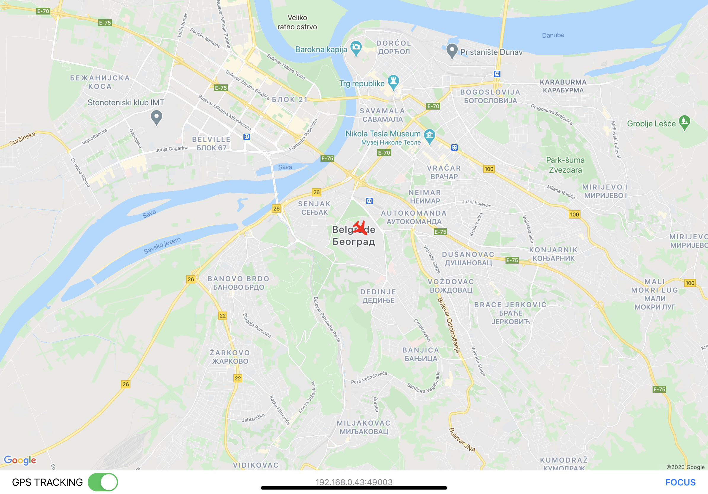
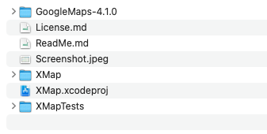

# X-Plane and MSFS 2020 Personal GoogleMaps GPS Tracker for iPad

XMap is X-Plane and MSFS 2020 flight tracker app enhancing the experience of Bush flying. 
XMap displays live aircraft position on your iPad using Google maps.



### 1. Create GoogleMaps API Key
[Getting an API Key](https://developers.google.com/maps/documentation/ios-sdk/get-api-key)

Don't forget to visit [Dashboard](https://console.cloud.google.com/apis/dashboard) and enable GoogleMaps API

Restrict your API key to iOS apps and GoogleMapsAPI

### 2. Download GoogleMaps iOS SDK

Download the latest GoogleMaps iOS SDK and unpack the archive to the root directory of the project



### 3. Create file named SDKConstants.swift with the contents below:
```
import Foundation

struct SDKConstants {
   static let APIKey = "<YOUR_GOOGLE_MAPS_API_KEY>"
}
```
Save it to ```XMap/SDKConstants.swift```

## X-Plane

### 4. Configure X-Plane to share GPS data via UDP

Launch the XMap app and observe IP address and port number eg. 192.168.0.43:49003 on the main screen.
Run X-Plane go to Settings -> Data Output, check rows 19 and 20 under Network via UDP column.
Check Send network data output and enter iPad IP address and port eg. 192.168.0.43 port 4903.

Tested on X-Plane 11.5

## MSFS 2020

### 4. Use [SimConnect-UDP](https://github.com/sdrpa/SimConnect-UDP) to broadcast MSFS 2020 data via UDP

### Other Resources

https://developers.google.com/maps/documentation/ios-sdk/start#install-manually   
  

### License

[MIT](https://en.wikipedia.org/wiki/MIT_License)
